# IAM (Identity and Access Management)

📘 **Depth:** Beginner  
💡 **Purpose:** Control who can access AWS resources and what they can do  
✅ **Practical Coverage:** IAM users, groups, roles, and policies via AWS Console  

---

## Table of Contents
1. [IAM Concepts](#iam-concepts)
2. [IAM Hands-On (Console)](#iam-hands-on-console)

---

<strong>1. IAM Concepts</strong>

---

## 1. Why Do We Need IAM?

Imagine AWS as a huge company building full of resources — EC2 machines, S3 storage rooms, databases, and more.  
Without IAM, **anyone with the root account** could wander around, touch everything, and accidentally delete critical servers.  
That’s where IAM steps in — it’s your **security department**, giving each person a personalized keycard that unlocks only what they need.

---

### 2. Analogy

Think of **AWS as a company building**:  
- The **Root user** is the **company owner** — full control over everything.  
- **IAM Users** are **employees** with their own ID cards to enter the building.  
- **Groups** are **departments** like *Developers* or *Finance*, each with specific duties.  
- **Policies** are the **rules** that define what each department or user can access.  
- **Roles** are **temporary visitor passes** for people or systems that need short-term access.  
- **MFA** is like a **security guard** asking for a second proof before entry.  

> 🧠 IAM is the security department of your AWS company — it decides *who gets in*, *what doors they can open*, and *how safely they can move around.*

---

## 3. Concept Understanding

### IAM is Global
IAM isn’t tied to any AWS region — the settings apply across all regions.

### 🧍 Users
- **Users** represent individual people or specific services that need access to your AWS account.  
- Each user gets their own **credentials** — a unique username, password, and (optionally) access keys for programmatic access.  
- This separation keeps actions traceable to specific individuals, improving **security** and **accountability**.  
- Example:  
  - `alice` might use the console to manage EC2 instances.  
  - `build-server` (a service user) might use access keys to deploy applications automatically.  
- **Best practice:** *One user = One human or service.* Never share credentials between people.

### 👥 Groups
- **Groups** are collections of IAM users who share similar job roles or responsibilities.  
- Instead of assigning permissions to each user one by one, you assign them to a **group** — and all members automatically inherit those permissions.  
- This makes access control **organized**, **scalable**, and **easy to audit**.  
- Example:  
  - The `Developers` group has the **AmazonEC2FullAccess** policy.  
  - Any new developer added to the group instantly gets EC2 permissions — no extra setup needed.  
- A user can belong to **multiple groups** (e.g., `Developers` and `Audit-Team`), combining permissions from both.

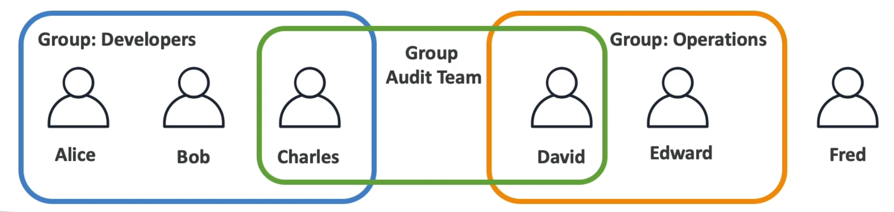

### 📜 Policies
- **Policies** are permission documents written in **JSON** that define what actions are **allowed** or **denied** in AWS.  
- They decide **who can do what** and on **which resources**.  
- Policies can be attached to **users**, **groups**, or **roles** to grant specific levels of access.  
- Each policy is made up of key fields:  
  - **Effect:** Allow or Deny  
  - **Action:** The specific AWS service operations (e.g., `ec2:StartInstances`)  
  - **Resource:** The AWS resources those actions apply to  
- Example: A “ReadOnlyAccess” policy allows viewing resources but blocks any changes.

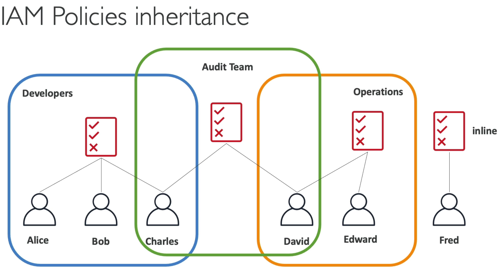 

### 🧩 Roles
- **Roles** are temporary identities that give permissions to AWS services or applications.  
- Instead of long-term credentials, roles use **temporary security tokens** for safer access.  
- Example: An **EC2 instance** can assume a role to access an **S3 bucket** without storing keys.  
- Best practice: Humans use IAM Users, AWS services use IAM Roles.

---

### 🏁 Best Practices
1. **Never use root account** for daily tasks  
2. **Use groups** to manage permissions at scale  
3. **Regularly audit permissions** (remove unused access)  
4. **Enable MFA** for all users  
5. **Apply least privilege principle**

---

---

<strong>2. IAM Hands-On (Console)</strong>

---

### 🎯 Excerise:
Create an IAM user, add it to a group, attach policies, test access, and secure it with MFA.

---

### **Step 1: Open IAM Console**
1. Log in as the **root user** → [https://aws.amazon.com/console](https://aws.amazon.com/console)  
2. Search for **IAM** in the service bar.  
3. Observe the **IAM Dashboard** — it shows account summary, MFA status, and security recommendations.  

📸 Screenshot →   
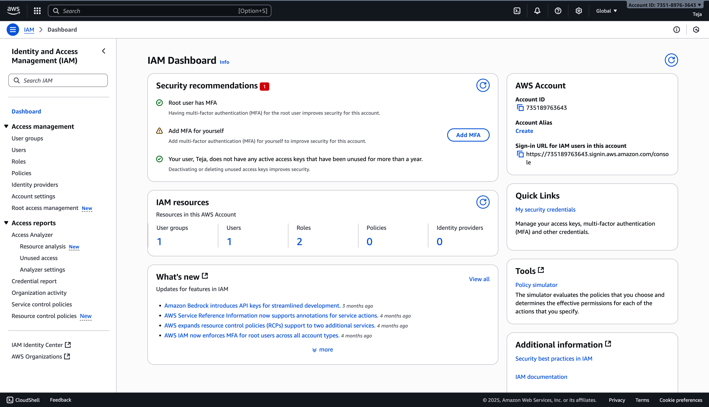

---

### **Step 2: Create a New User**
1. In the left sidebar → click **Users → Add users**.  

📸 Screenshot →     
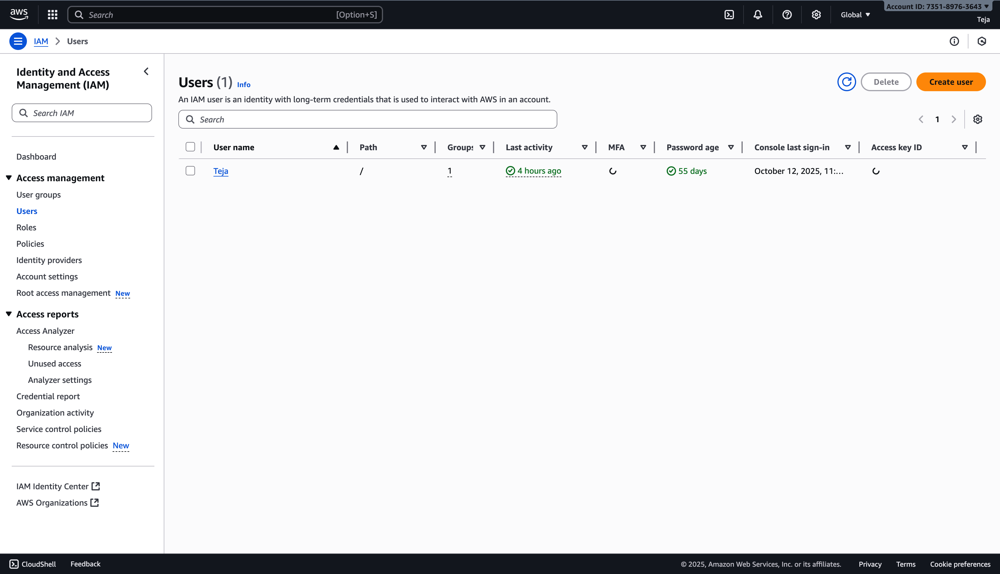   

2. Enter username: `devops-user`.  
3. Check **Provide user access to the AWS Management Console**.  
4. Choose **Custom password**, uncheck “Require password reset.”  
5. Click **Next**.  

📸 Screenshot →   
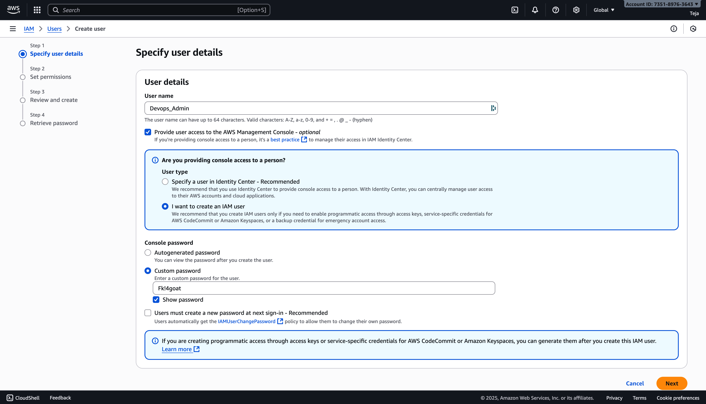

---

### **Step 3: Create a Group and Assign Permissions**
1. Choose **Add user to group → Create group.**  

📸 Screenshot →     
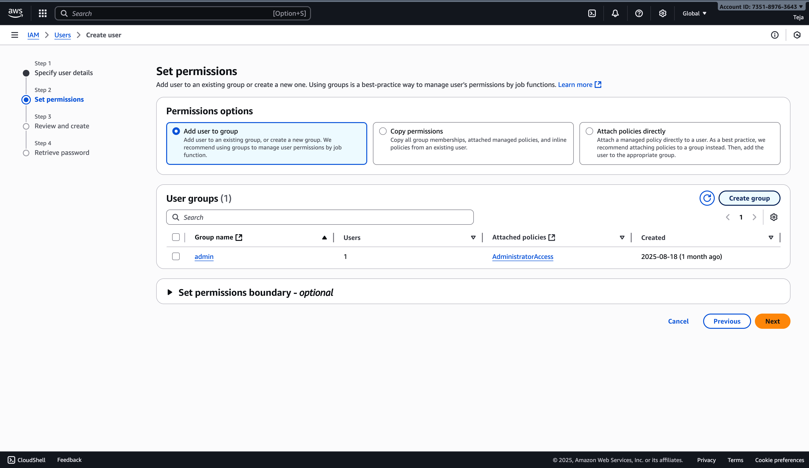

2. Name the group: `DevOps-Admins`.  
3. From the policy list, select **AdministratorAccess.**  
   - This gives full permissions across AWS services — ideal for admin-level users.  
   - *(For learning environments, you can later replace this with a custom least-privilege policy.)*  
4. Click **Create group** → select it → click **Next** → **Create user.**

📸 Screenshot →     
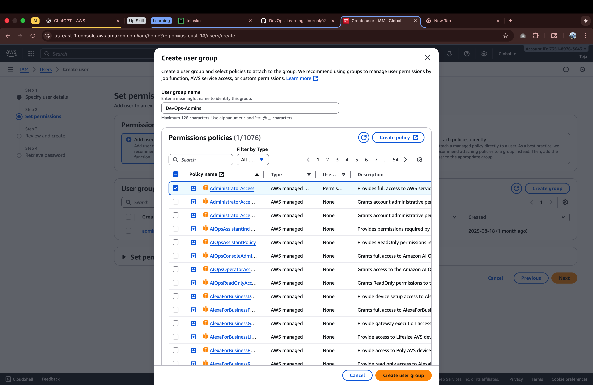

5. After the user is created, you’ll see the **Retrieve password** screen.  
   It displays your **sign-in URL**, **username**, and **temporary password**.  

📸 Screenshot →  

6. Click **“Download .csv file.”**  
   - This file contains your new user’s **username**, **password**, and **sign-in URL.**  
   - Save it somewhere **secure** (e.g., a private folder, not GitHub or shared drives).  
   - ⚠️ You will **not** be able to view this password again later.

7. *(Optional but Recommended)* — Click **“Email sign-in instructions.”**  
   - This opens an email template to send login details securely to yourself.

8. Click **“Return to users list.”**  
   - You’ll be redirected to the **IAM → Users** page.  
   - You’ll now see your new user **`Devops_Admin`** listed successfully.
---

### **Step 4: Log In as IAM User**
1. Copy the **Sign-in URL** displayed after user creation (looks like:  
   `https://<account-id>.signin.aws.amazon.com/console`).  
2. Log out from root and log in with:  
   - Username: `Devops_Admin`  
   - Password: your custom password  
3. You should now see the full AWS Console as an IAM Administrator.
  
📸 Screenshot →    
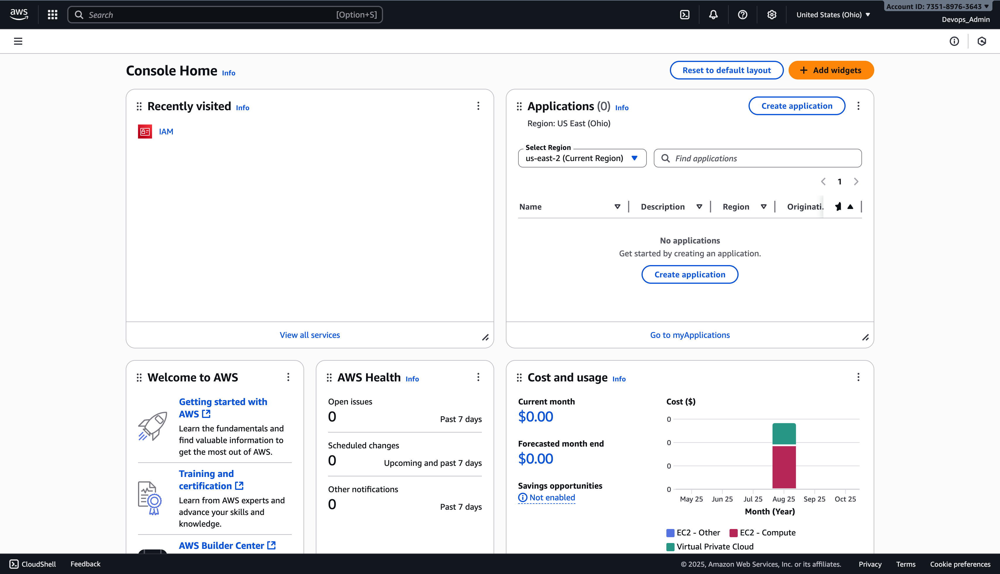
---

### **Step 5: Test Permissions**

1. Open **EC2**, **S3**, **IAM**, and other services — your `Devops_Admin` user should have **full access** to all AWS services.  
2. To test least privilege, create another IAM user with restricted access:  
   - Go to **IAM → Users → Add users.**  
   - Enter username: `teja`  
   - Provide console access (same as before).  
   - Set a **custom password** (optional: uncheck “Require password reset”).  
   - Click **Next.**
3. Choose **Add user to group → Create group.**  
   - Name the group: `Developers`  
   - Attach the following **AWS Managed Policies:**  
     - `AmazonEC2ReadOnlyAccess`  
     - `AmazonS3ReadOnlyAccess`  
     - `IAMReadOnlyAccess`  
   - Click **Create group → Next → Create user.**

📸 Screenshot →   
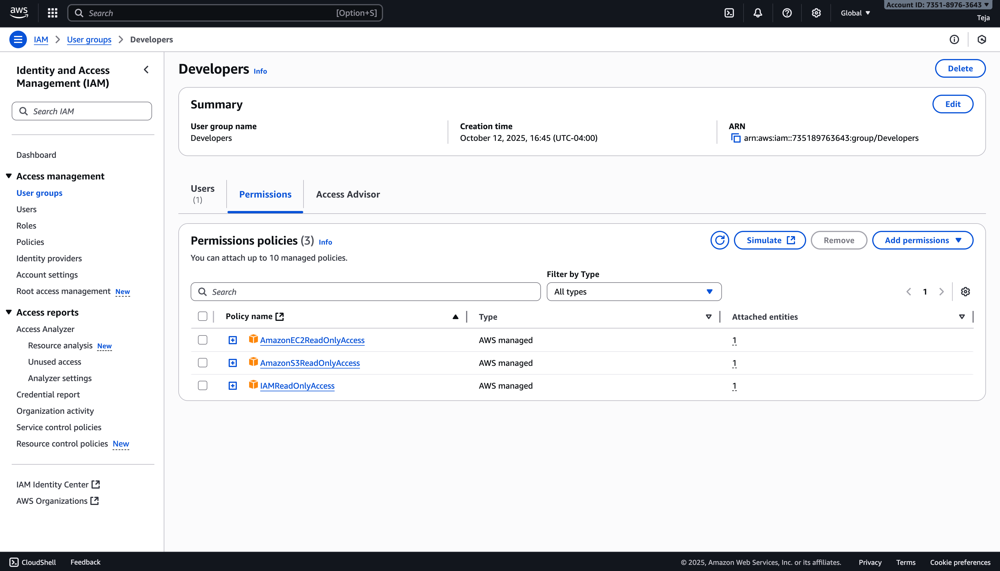

4. Log in using the new user credentials for `teja`:  
   - **Sign-in URL:** `https://735189763643.signin.aws.amazon.com/console`  
   - **Username:** `teja`  
   - **Password:** (from your downloaded .csv file)
5. Test permissions:  
   - Open **EC2**, **S3**, and **IAM** — you should be able to **view** resources but **cannot create, edit, or delete** them.  
   - This confirms that your `Developers` group and Read-Only policies are working correctly.

📸 Screenshot →   
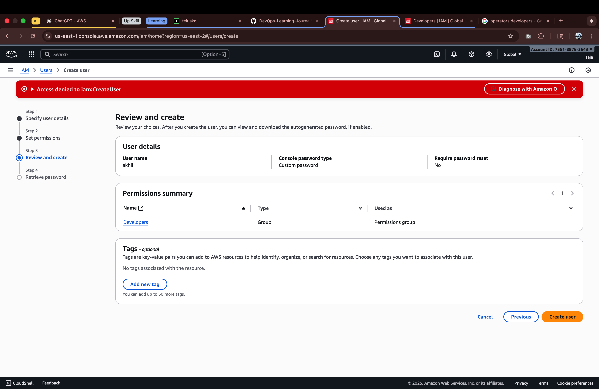

6. Switch back to your `Devops_Admin` user to regain full permissions.

✅ **Result:**  
You now have two properly configured IAM users —  
- **`Devops_Admin`** → Full administrative access  
- **`teja` (Developers group)** → Read-only access across EC2, S3, and IAM

---

### **Step 6: Enable MFA for Extra Security**
1. Back in IAM → select your `devops-admin` user.  
2. Go to **Security credentials → Assign MFA device.**  

📸 Screenshot →   
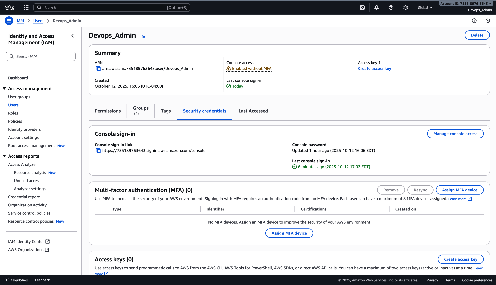

3. Choose **Virtual MFA** → scan the QR code using Google Authenticator or Authy.  
4. Enter two consecutive codes → **Assign MFA.**  

📸 Screenshot →   
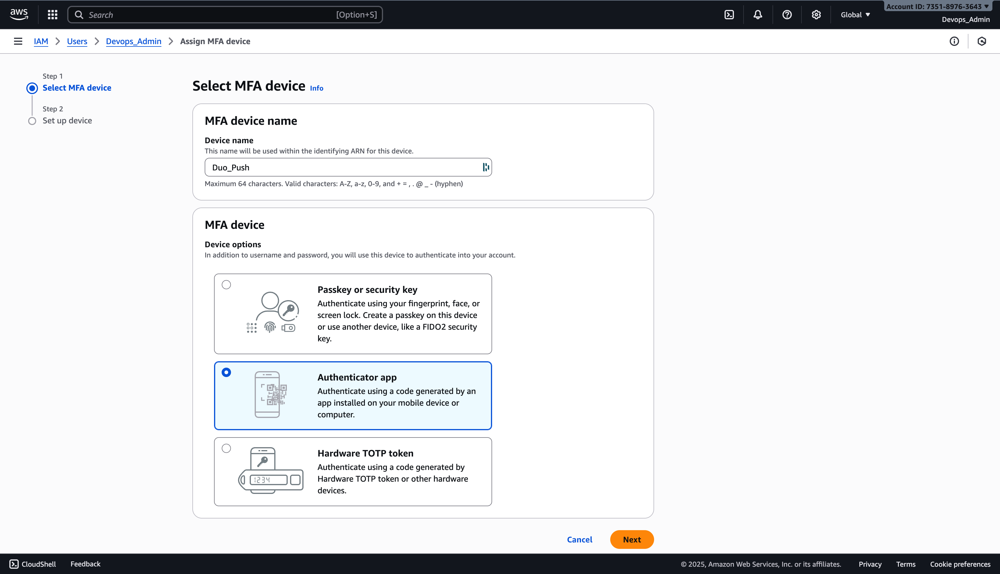
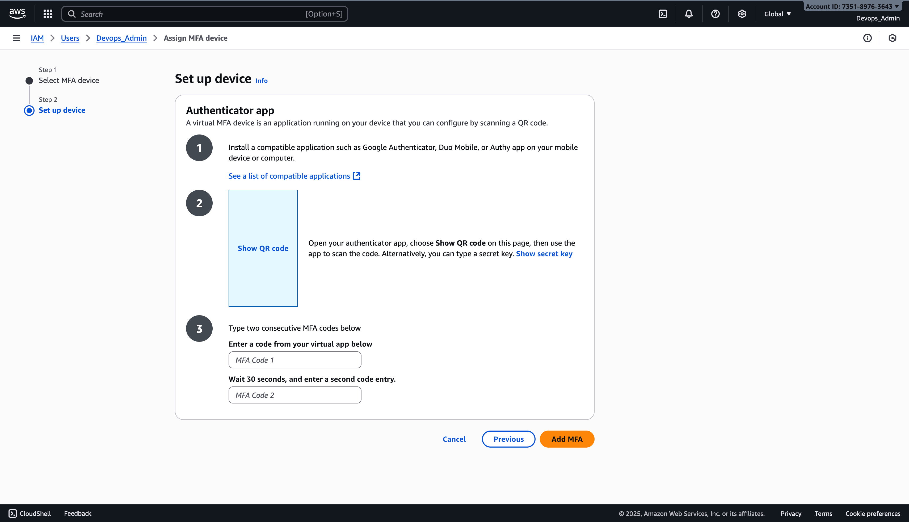

---