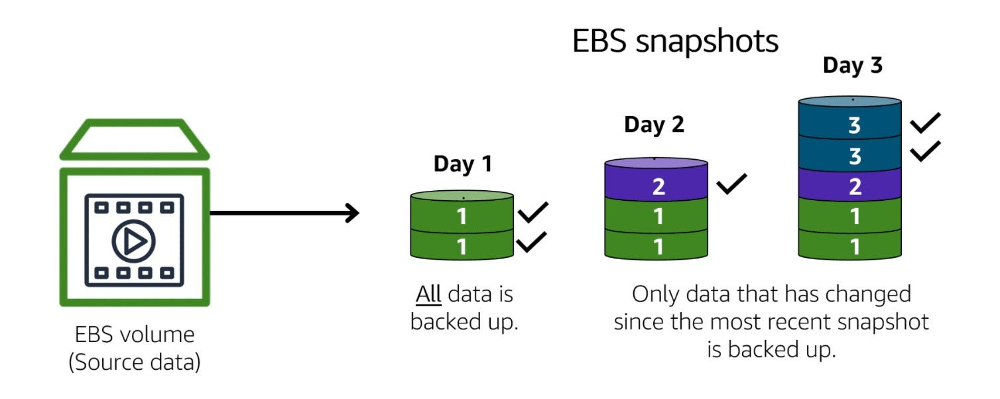
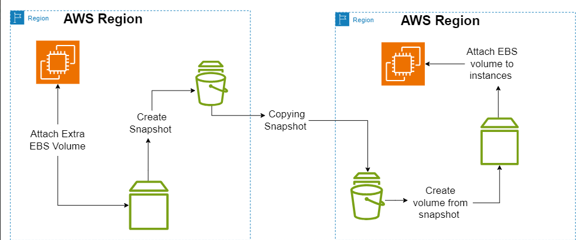

# Snapshots & Web Servers (httpd)

## Table of Contents

1. [Snapshots in AWS](#1-snapshots-in-aws)
2. [Copying Data Across Availability Zones](#2-copying-data-across-availability-zones)
3. [Websites & Web Servers](#3-websites--web-servers)
4. [Hosting a Static Website using httpd](#4-hosting-a-static-website-using-httpd)
5. [Quick Command Summary](#5-quick-command-summary)

---

<details>
<summary><strong>1. Snapshots in AWS</strong></summary>

### What is a Snapshot?

* Think of an **EBS Volume** (Elastic Block Store) as a **hard disk** attached to your EC2 instance.
* A **Snapshot** is like taking a **photograph/backup** of that disk at a specific moment in time.

### Key Points

* **Volumes are Zone-specific** → You can only attach a volume to an EC2 in the *same Availability Zone (AZ)*.
* **Snapshots are Region-specific** → A snapshot can be used anywhere within the same AWS Region.
* You can create a snapshot from a volume and then later **restore** it to create new volumes.

```
EBS Volume → Snapshot → New Volume
```

* Snapshots **cannot** be directly attached to an instance. They are only **templates**.
* Volumes created from snapshots **can** be attached to EC2.

### Why use Snapshots?

* **Backup:** Protect against accidental data loss.
* **Migration:** Move data between Availability Zones or Regions.
* **Disaster Recovery:** Keep a copy in another Region for emergencies.
* **Incremental Storage:** After the first full snapshot, AWS only saves *changed blocks*, saving cost.  

   
  
📌 In short → *Snapshots are the backup system for volumes in AWS.*

</details>

---

<details>
<summary><strong>2. Copying Data Across Availability Zones</strong></summary>

### Scenario

Suppose you have:

* An EC2 instance running in **us-east-1a** with some data on its volume.
* You want to move this data to a new EC2 instance in **us-east-1b**.

Since volumes are **zone-locked**, you can’t just detach and reattach across AZs.

### Solution

We use Snapshots as the bridge:

1. **Create a Snapshot** of the existing volume in `1a`.

   * This freezes the state of your volume.
2. **Create a new Volume** in `1b` from that snapshot.

   * AWS allows you to choose the AZ when restoring a snapshot.
3. **Attach** that new volume to the new EC2 in `1b`.

 

✅ This process is widely used for **migrating workloads between AZs** and **data replication**.

</details>

---

<details>
<summary><strong>3. Websites & Web Servers</strong></summary>

### What is a Website?

* A **website** is simply a collection of HTML pages that users can open in a browser.

**Types of Websites**:

1. **Static Website**

   * Same response for everyone.
   * Example: Portfolio page, simple company info site.

2. **Dynamic Website**

   * Response depends on the user.
   * Example: Gmail (shows your inbox), Facebook (shows your feed).

### What is a Web Server?

* A **web server** is a program/software that delivers web pages when requested by a browser.
* When you type a website URL, your browser sends a request → The web server responds with HTML content.

**Examples of Web Servers**:

* **Apache httpd** → Popular for static sites.
* **Apache Tomcat** → Used for Java-based web apps.
* **Nginx** → Lightweight, modern, used as reverse proxy + load balancer.

📌 Without a web server, your HTML files just sit on disk — no one can reach them.

</details>

---

<details>
<summary><strong>4. Hosting a Static Website using httpd</strong></summary>

### Step 1: Install httpd

```bash
sudo yum install httpd -y
```

This downloads and installs the Apache HTTP server package.

### Step 2: Start the httpd service

```bash
sudo service httpd start
```

This runs the server in the background, listening on **port 80** (default HTTP port).

### Step 3: Configure AWS Security Group

* Add an **Inbound Rule** for:

  * Port **80 (HTTP)** → To allow web traffic.
  * (Optional) Port **443 (HTTPS)** → If using SSL/TLS.

### Step 4: Navigate to the web directory

```bash
cd /var/www/html
pwd
#output
/var/www/html
```

This is the **default document root** for Apache.

### Step 5: Create your website file

```bash
sudo vi index.html
```

```html
<h1> Telusko DevOps Learning </h1>
```

### Step 6: Access your website

* Open browser → `http://<EC2-Public-IP>`
* You should see your `index.html` page served by Apache.

📌 This is the simplest way to host a static site on an EC2 instance.

</details>

---

<details>
<summary><strong>5. Quick Command Summary</strong></summary>

| Purpose                     | Command                                                                            |
| --------------------------- | ---------------------------------------------------------------------------------- |
| Create Snapshot             | `aws ec2 create-snapshot --volume-id <vol-id> --description "desc"`                |
| Create Volume from Snapshot | `aws ec2 create-volume --availability-zone <az> --snapshot-id <snap-id>`           |
| Attach Volume to EC2        | `aws ec2 attach-volume --volume-id <vol-id> --instance-id <id> --device /dev/xvdf` |
| Install Apache (httpd)      | `sudo yum install httpd -y`                                                        |
| Start Apache service        | `sudo service httpd start`                                                         |
| Navigate to web dir         | `cd /var/www/html`                                                                 |
| Create/Edit index.html      | `sudo vi index.html`                                                               |

</details>