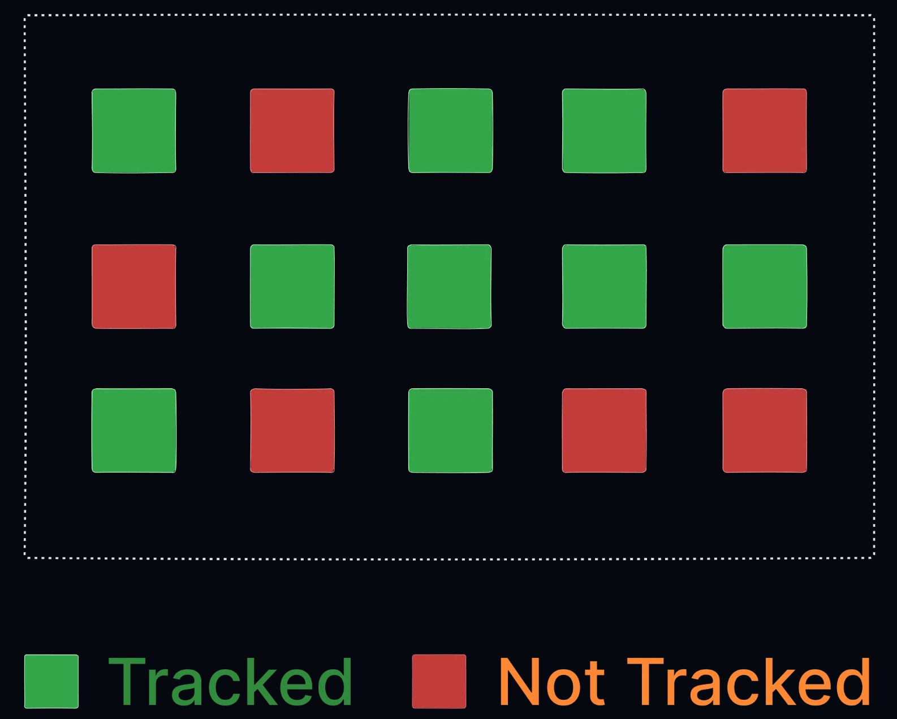

# Git Tutorial - 1

## Table of Contents

- [1. Git Config](#1-git-config) 
- [1. Git Config](#1-git-config) 
- [1. Git Config](#1-git-config) 

<details>
<summary><strong>1. Git Config</strong></summary>

## Basic Configuration

Set your name and email (required for commits):

```bash
git config --global user.name "Your Name"
git config --global user.email "you@example.com"
```

**Note:** These settings attach your identity to all commits. You can change them anytime.

## Viewing Configuration

List all settings:
```bash
git config --list
```

View specific setting:
```bash
git config user.name
```

## Configuration Levels

| Level    | Flag         | Scope                     |
|----------|--------------|---------------------------|
| System   | `--system`   | All users on computer     |
| Global   | `--global`   | Current user (default)    |
| Local    | `--local`    | Current repository only   |

**Precedence:** Local > Global > System

## Common Configuration Examples

Set default branch name:
```bash
git config --global init.defaultBranch main
```

Remove a setting:
```bash
git config --global --unset code.editor
```

## Best Practices

1. Always configure name/email before first commit
2. Use `--global` for personal defaults
3. Use `--local` for project-specific settings
4. Set default branch name to avoid "master"

</details>

---

<details>
<summary><strong>2. Working with New Files</strong></summary>

### What is a Repository?

A Git repository is a folder that Git tracks for changes.  
The repository stores all your project's history and versions.  

```bash
git init
```
 
* This command will create a new folder on your system and initialize it as a git repository.  
* This adds a hidden `.git` folder to your project. 

### What Happens When You Run git init?  

Git creates a hidden folder called .git inside your project.  
This is where Git stores all the information it needs to track your files and history.  

### Example: Show Hidden .git Folder (Linux/macOS)
```bash
ls -a   
.  ..  .git
```

### What is a New File?
A new file is one you've created or copied into your project folder, but haven't told Git to track yet.

### Creating a New File
1. Create a file in your project folder (example: `index.html`)
2. Example HTML file:
```html
<!DOCTYPE html>
<html>
<head>
<title>Hello World!</title>
</head>
<body>
<h1>Hello world!</h1>
<p>First file in my Git repo</p>
</body>
</html>
```

### Checking Files
List files in directory:
```bash
ls
# Output: index.html
```

Check tracking status:
```bash
git status
# Output:
# On branch master
# No commits yet
# Untracked files: index.html
```

## File Status Types
| Status     | Description                          |
|------------|--------------------------------------|
| Untracked  | Git sees but isn't monitoring (new files) |
| Tracked    | Git is actively monitoring changes   |

### Tracked vs Not Tracked

Not all folders are meant to be tracked by git. Here's the difference between tracked and not tracked items:

   

* *Green folders are projects getting tracked by git while red ones are not.*   
* Not all folders are meant to be tracked by git. Here we can see that all green folders are projects are getting tracked by git but red ones are not.   


## Complete git flow

When you want to track a new folder, you first use init command to create a new repository. Then you can use add command to add the folder to the repository. After that you can use commit command to save the changes. Finally you can use push command to push the changes to github. Of course there is more to it but this is the basic flow.

* A complete git flow, along with pushing the code to github looks like this:

 