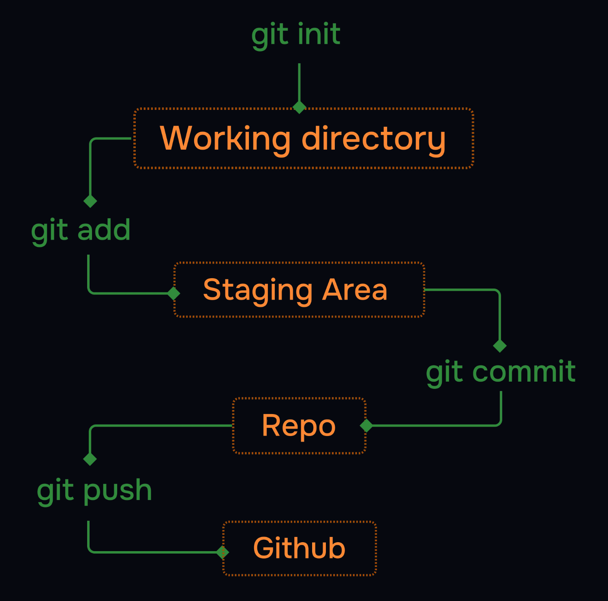

# Git Tutorial - 1

## Table of Contents

- [1. Git Config](#1-git-config) 
- [2. Git New File](#2-git-new-file) 
- [3. Git Staging Environment](#3-git-staging-environment) 
- [4. Git Commit](#4-git-commit) 
- [5. Git Workflow](#5-git-workflow) 

<details>
<summary><strong>1. Git Config</strong></summary>

## Basic Configuration

Set your name and email (required for commits):

```bash
git config --global user.name "Your Name"
git config --global user.email "you@example.com"
```

**Note:** These settings attach your identity to all commits. You can change them anytime.

## Viewing Configuration

List all settings:
```bash
git config --list
```

View specific setting:
```bash
git config user.name
```

## Configuration Levels

| Level    | Flag         | Scope                     |
|----------|--------------|---------------------------|
| System   | `--system`   | All users on computer     |
| Global   | `--global`   | Current user (default)    |
| Local    | `--local`    | Current repository only   |

**Precedence:** Local > Global > System

</details>

---

<details>
<summary><strong>2. Git New Files</strong></summary>

### What is a Repository?

A Git repository is a folder that Git tracks for changes.  
The repository stores all your project's history and versions.  

```bash
git init #(Git initialization)
```
 
* This command will create a new folder on your system and initialize it as a git repository.  
* This adds a hidden `.git` folder to your project. 
* This is where Git stores all the information it needs to track your files and history.   

### Example: Show Hidden .git Folder (Linux/macOS)
```bash
ls -la   
.    
..    
.git   
```

### What is a New File?
A new file is one you've created or copied into your project folder, but haven't told Git to track yet.

### Creating a New File
1. Create a file in your project folder (example: `index.html`)
2. Example HTML file:
```html
<!DOCTYPE html>
<html>
<head>
<title>Hello World!</title>
</head>
<body>
<h1>Hello world!</h1>
<p>First file in my Git repo</p>
</body>
</html>
```

### Check tracking status:
```bash
git status
# Output:
# On branch master
# No commits yet
# Untracked files: index.html (displays)
```

## File Status Types
| Status     | Description                          |
|------------|--------------------------------------|
| Untracked  | RED - Git sees but isn't monitoring (new files) |
| Tracked    | GREEN - Git is actively monitoring changes   | 

</details>

---

<details>
<summary><strong>3. Git Staging Environment</strong></summary>

### What is the Staging Environment?
* The staging environment (or staging area) is like a waiting room for your changes.   
* You use it to tell Git exactly which files you want to include in your next commit.  
* This gives you control over what goes into your project history.  
* Here are some key commands for staging:  

- `git add <file>` - Stage a file  
- `git add --all` or `git add -A` - Stage all changes  
- `git status` - See what is staged  
- `git restore --staged <file>` - Unstage a file  

### Stage a File with git add
To add a file to the staging area, use `git add <file>`:  

```bash
git add index.html
```

Now index.html is staged. You can check what is staged with `git status`:  

```bash
git status
On branch master

No commits yet

Changes to be committed:
  (use "git restore --staged ..." to unstage)
    new file: index.html
```

### Stage Multiple Files (git add --all, git add -A)
You can stage all changes (new, modified, and deleted files) at once:  

```bash
git add --all
```

`git add -A` does the same thing as `git add --all`.  

### Check Staged Files with git status
See which files are staged and ready to commit:  

```bash
git status
On branch master

No commits yet

Changes to be committed:
  (use "git restore --staged ..." to unstage)
        new file:   README.md
        new file:   bluestyle.css
        new file:   index.html
```

### How to Unstage a File
If you staged a file by mistake, you can remove it from the staging area (unstage it) with:  

```bash
git restore --staged index.html
```

Now index.html is no longer staged. You can also use `git reset HEAD index.html` for the same effect.  

### Troubleshooting
- Staged the wrong file? Use `git restore --staged <file>` to unstage it.  
- Forgot to stage a file? Just run `git add <file>` again before you commit.  
- Not sure what's staged? Run `git status` to see what will be committed.  

### Git Add Command Comparison

| Command         | Scope | New Files | Modified Files | Deleted Files |
|-----------------|-------|-----------|----------------|---------------|
| `git add .`     | Current directory only | ✓ | ✓ | ✓ |
| `git add -A`    | Entire repository | ✓ | ✓ | ✓ |
| `git add --all` | Entire repository | ✓ | ✓ | ✓ |

### Example Scenario:
If you're in a subfolder:
```bash
/repo
  /subfolder
    file1.txt (modified)
  file2.txt (deleted)
```
- `git add .` (from subfolder) → stages only file1.txt
- `git add -A` → stages both file1.txt and file2.txt

</details>

---

<details>
<summary><strong>4. Git Commit</strong></summary>

A commit is like a save point in your project.   
It records a snapshot of your files at a certain time, with a message describing what changed.   
You can always go back to a previous commit if you need to.   
Here are some key commands for commits:   

```bash
git commit -m "message" - Commit staged changes with a message
git commit -a -m "message" - Commit all tracked changes (skip staging)
```

### Standard Commit
```bash
git commit -m "Add login feature"
```
- Requires files to be staged first (`git add`)
- Always write clear, descriptive messages

### Commit All Tracked Changes
```bash
git commit -a -m "Update config files"
```
- Skips staging for modified/deleted files
- Doesn't include new/untracked files
- **Warning:** Can accidentally include unwanted changes

## Advanced Options

```bash
git commit --amend                       # Edit last commit
git commit --no-edit                     # Reuse previous message
git commit --allow-empty -m "Trigger CI"  # Create empty commit
```

## Troubleshooting

| Issue | Solution |
|-------|----------|
| Forgot to stage file | `git add` then new commit or `--amend` |
| Wrong commit message | `git commit --amend -m "New message"` |
| Committed wrong files | `git reset --soft HEAD~1` |

</details>

---

<details>
<summary><strong>5. Git Workflow</strong></summary>


## Complete git flow

When you want to track a new folder, you first use init command to create a new repository. Then you can use add command to add the folder to the repository. After that you can use commit command to save the changes. Finally you can use push command to push the changes to github. Of course there is more to it but this is the basic flow.

* A complete git flow, along with pushing the code to github looks like this:

 

</details>