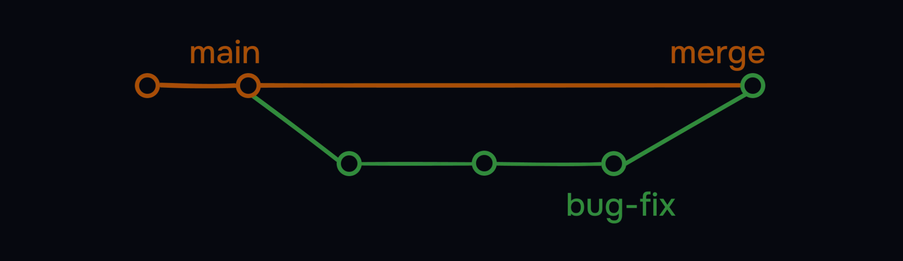
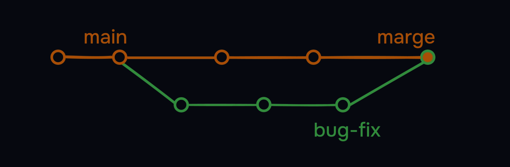
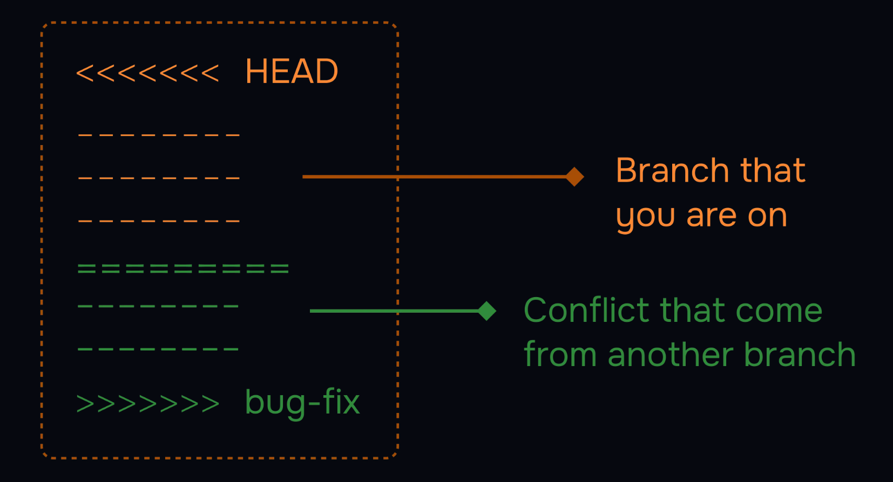

# Git Tutorial - 3

## Table of Contents

- [1. Git History](#1-git-History) 
- [1. Git Branches](#2-git-branches) 


<details>
<summary><strong>1. Git History</strong></summary>

### What is Git History? Why Use It?

Git keeps a detailed record of every change made to your project.

You can use history commands to see what changed, when, and who made the change.

This is useful for tracking progress, finding bugs, and understanding your project's evolution.

---

### Key Commands for Viewing History

- `git log` - Show full commit history
- `git log --oneline` - Show a summary of commits
- `git show <commit>` - Show details of a specific commit
- `git diff` - See unstaged changes
- `git diff --staged` - See staged changes

---

### Best Practices for Viewing History

- Make frequent, meaningful commits to keep your history clear.
- Write clear commit messages so you and your team can understand changes later.
- Use `git log --oneline` for a quick overview of your commit history.
- Use `git diff` before committing to review your work.

---

## See Commit History (git log)

Show a detailed list of all commits in your repository:

### Example: Full Commit History

```bash
akhiltejadoosari@Akhils-MacBook-Air DevOps-Learning-Journal % git log
commit 7108d2c349c861873d59c898aedf6a5070877841 (HEAD -> main, origin/main, origin/HEAD)
Author: Akhil Teja Doosari <doosariakhilteja@gmail.com>
Date:   Tue Aug 12 23:30:16 2025 -0400

    Git 
```

This command shows all commits, including author, date, and message.

Use the arrow keys to scroll, and press `q` to quit.

**Tip:** While viewing the log, you can search for a word by typing `/` followed by your search term  
(for example, `/fix`), then press `n` to jump to the next match.  

Press `q` at any time to quit.

---

## Show Commit Details (git show <commit>)

See all the details and changes for a specific commit:

```bash
[user@localhost] $ git show <commit>
```

This command shows everything about a commit: who made it, when, the message, and the exact changes.

---

## Compare Changes (git diff)

See what is different between your working directory and the last commit :

### 1. Unstaged Changes

This command shows changes you have made but not yet staged for commit.  

```bash
[user@localhost] $ git diff 
```
```bash
diff --git a/index.html b/index.html 
index 1234567...89abcde 100644 
--- a/index.html 
+++ b/index.html 
@@ ... 
-Old Title 
+New Title
```

---

### 2. Staged Changes

This command shows changes that are staged and ready to be committed.  

```bash
[user@localhost] $ git diff --staged
```
 

---

## Compare Two Commits (git diff < commit.1 > < commit.2 >)

See what changed between any two commits:

### Example: 

```bash
[user@localhost] $ git diff 1234567 89abcde
diff --git a/index.html b/index.html
index 1234567...89abcde 100644
--- a/index.html
+++ b/index.html
@@ ...
-Old Title
+New Title
```

---

## Show a Summary of Commits (git log --oneline )

Show a short summary of each commit (great for a quick overview):
This command shows each commit on a single line for easy reading.  

### Example:

```bash
[user@localhost] $ git log --oneline  
09f4acd Updated index.html with a new line  
8e7b2c1 Add about page  
1a2b3c4 Initial commit  
```
---

## Show Commits by Author (git log --author="Akhil")

See only the commits made by a specific author:
This command filters the log to show only commits by the author you specify.  

### Example: 

```bash
[user@localhost] $ git log --author="Akhil"  
commit 1a2b3c4d5e6f7g8h9i0j  
Author: Akhil  
Date: Mon Mar 22 10:12:34 2021 +0100  

     Add about page  
```

---

## Recent Commits

See only commits made in the last two weeks:  
This command shows only the commits made in a recent time frame.  

### Example: 

```bash
[user@localhost] $ git log --since="2 weeks ago"
commit 09f4acd3f8836b7ff6fc44ad9e012f82faf861803
Author: w3schools-test
Date: Fri Mar 26 09:35:54 2021 +0100

Updated index.html with a new line
```

---

## Show Files Changed Per Commit (git log --stat)

See which files were changed in each commit and how many lines were added or removed:

### Example: 

```bash
[user@localhost] $ git log --stat
commit 09f4acd3f8836b7ff6fc44ad9e012f82faf861803
Author: w3schools-test
Date: Fri Mar 26 09:35:54 2021 +0100

Updated index.html with a new line

index.html | 2 +
1 file changed, 1 insertion(+), 1 deletion(-)
```

---

## Log with Graph

See a simple ASCII graph of your branch history (great for visualizing merges):  
This command shows a simple graph of your branch and merge history.  

### Example: 

```bash
[user@localhost] $ git log --graph --oneline
* 09f4acd Updated index.html with a new line
* 8e7b2c1 Add about page
l\
| * adbbccd Merge branch 'feature-x'
|/
```

---

## Troubleshooting

- Can't see your changes? Make sure you have committed your work. Uncommitted changes won't appear in the history.
- Log is too long? Use `git log --oneline` or `git log --since` to make it easier to read.
- How do I quit the log view? Press `q` to exit the log or diff view.

**Note:** Exploring your history helps you understand what changed, when, and why.

</details>

---

<details>
<summary><strong>2. Git Branches</strong></summary>

Branches are a way to work on different versions of a project at the same time. They allow you to create a separate line of development that can be worked on independently of the main branch. This can be useful when you want to make changes to a project without affecting the main branch or when you want to work on a new feature or bug fix.


*Example: Some developers can work on Header, some on Footer, some on Content, and some on Layout - all in separate branches.*

## HEAD in Git

The HEAD is a pointer to the current branch you're working on. It points to the latest commit in the current branch. When you create a new branch, it's automatically set as the HEAD of that branch.

- The default branch used to be called `master`, but it's now conventionally called `main`
- There's nothing special about `main` - it's just a naming convention

## Creating and Managing Branches

### Create and switch branches:
```bash
git branch - List all branches
```
```bash
git branch bug-fix - Create new branch
```
```bash
git switch bug-fix - Switch to branch
```
```bash
git log - This command shows the commit history for the current branch.
```
```bash
git switch -c dark-mode - Create and switch in one command
```
```bash
git branch -m old-name new-name - Rename a branch
```
```bash
git branch -d branch-name - Delete a branch
```
## Merging Branches

Merging brings changes from one branch to another.  
There are two types:

### Fast-Forward Merge

In Git, a fast-forward merge occurs when you merge a feature branch (like bug-fix) back into the main branch, and main hasn't received any new commits since bug-fix was created.  

```bash
git checkout main
git merge bug-fix
```
   

* History remains linear and clean.

### 3-Way Merge

A 3-way merge occurs when you merge two branches (main and feature) that both have new commits since their last common ancestor.  

```bash
git checkout main
git merge bug-fix
```


*Required when branches have diverged - Git looks at:*
1. Common ancestor commit
2. Tips of each branch
3. Creates a new merge commit

> If the command are same, what is the difference between fast-forward and not fast-forward merge?  

The difference is resolving the conflicts. In a fast-forward merge, there are no conflicts. But in a not fast-forward merge, there are conflicts, and there are no shortcuts to resolve them. You have to manually resolve the conflicts. Decide, what to keep and what to discard. VSCode has a built-in merge tool that can help you resolve the conflicts.  



*Tools to help:*
- VSCode's built-in merge tool (recommended)
- GitHub's merge tool
- Command line resolution

## Conclusion

In this section, we've learned:
- Branch creation and switching
- Two merge types (fast-forward vs 3-way)
- Conflict resolution techniques
- Branch management commands

*Remember: Branches enable parallel development while maintaining code stability.*

# Managing History

This guide will help you understand how to manage your Git history effectively.

## Merge commits

A merge commit is a commit that combines two or more commits into one. It is created when you merge two or more branches into a single branch. The merge commit contains all the changes from the original branches, and it is used to keep the project history clean and easy to understand.

 
</details>