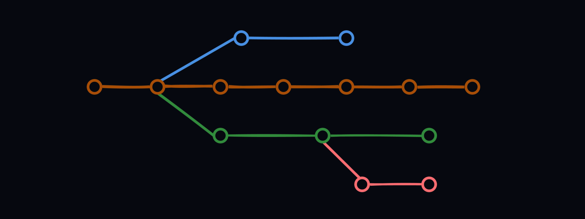
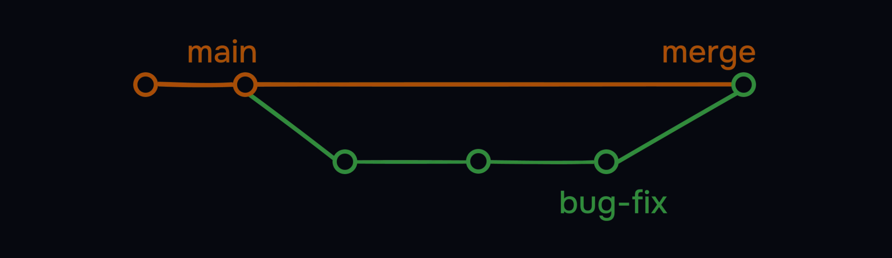
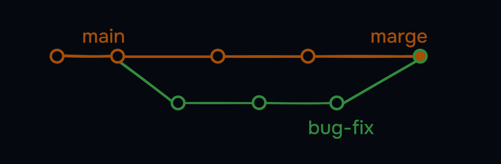
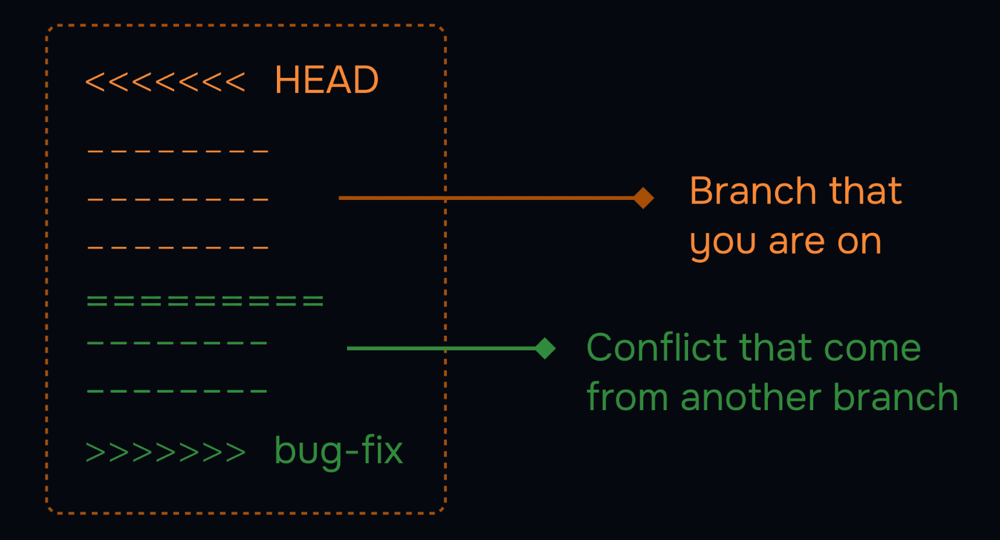

# Branches in Git

Branches are a way to work on different versions of a project at the same time. They allow you to create a separate line of development that can be worked on independently of the main branch. This can be useful when you want to make changes to a project without affecting the main branch or when you want to work on a new feature or bug fix.



*Example: Some developers can work on Header, some on Footer, some on Content, and some on Layout - all in separate branches.*

## HEAD in Git

The HEAD is a pointer to the current branch you're working on. It points to the latest commit in the current branch. When you create a new branch, it's automatically set as the HEAD of that branch.

- The default branch used to be called `master`, but it's now conventionally called `main`
- There's nothing special about `main` - it's just a naming convention

## Creating and Managing Branches

### Create and switch branches:
```bash
git branch - List all branches
```
```bash
git branch bug-fix - Create new branch
```
```bash
git switch bug-fix - Switch to branch
```
```bash
git log - This command shows the commit history for the current branch.
```
```bash
git switch -c dark-mode - Create and switch in one command
```
```bash
git branch -m old-name new-name - Rename a branch
```
```bash
git branch -d branch-name - Delete a branch
```
## Merging Branches

Merging brings changes from one branch to another.  
There are two types:

### Fast-Forward Merge

In Git, a fast-forward merge occurs when you merge a feature branch (like bug-fix) back into the main branch, and main hasn't received any new commits since bug-fix was created.  

```bash
git checkout main
git merge bug-fix
```
   

* History remains linear and clean.

### 3-Way Merge

A 3-way merge occurs when you merge two branches (main and feature) that both have new commits since their last common ancestor.  

```bash
git checkout main
git merge bug-fix
```


*Required when branches have diverged - Git looks at:*
1. Common ancestor commit
2. Tips of each branch
3. Creates a new merge commit

> If the command are same, what is the difference between fast-forward and not fast-forward merge?  

The difference is resolving the conflicts. In a fast-forward merge, there are no conflicts. But in a not fast-forward merge, there are conflicts, and there are no shortcuts to resolve them. You have to manually resolve the conflicts. Decide, what to keep and what to discard. VSCode has a built-in merge tool that can help you resolve the conflicts.  



*Tools to help:*
- VSCode's built-in merge tool (recommended)
- GitHub's merge tool
- Command line resolution

## Conclusion

In this section, we've learned:
- Branch creation and switching
- Two merge types (fast-forward vs 3-way)
- Conflict resolution techniques
- Branch management commands

*Remember: Branches enable parallel development while maintaining code stability.*